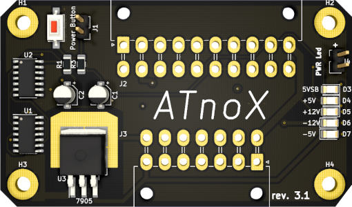

# ATnoX

## Introduction

The ATnoX was born out of the necessity for me to have a small adapter adapter I could use to fit AT/XT motherboards into modern cases, powering them with ATX power supplies and turning them on with a momentary switch (the standard power on button present in computer cases built in the last 20+ years).

The [ATX2AT](https://x86.fr/atx2at-smart-converter/) is a wonderful device (I own several of them), but I prefer to use it to test my boards and then fall back onto a cheaper alternative I can close inside a case without it feeling like a waste.

In fact, the output connector uses the same pinout as the ATX2AT, but as I still had a free pin available, I decided to include a **TICK generator**: a 50/60hz square wave signal required by some big-box Amigas to turn on.



## Pinout

```text
                ____
.----.----.----|----|----.----.----.
| 22 | 21 | 20 | 19 | 18 | 17 | 16 |
|----+----+----+----+----+----+----|
|    |    |    |    |    |    |    |
'----'----'----'----'----'----'----'

```

## Component list

**TODO**

## Features

- -5v onboard generation via a 7905 regulator
- Momentary button power-on support
- Header for power led in case the motherboard lacks it
- Power on button included on board for bench testing
- Optional amiga Tick generator
- 4 Layer board (middle layers are +5v and GND)

## Credits

- logic-4000 libraries taken from [alexisvl/kicad-schlib](https://github.com/alexisvl/kicad-schlib)
- ATX power-on circuit taken from [skiselev/isa8_backplane](https://github.com/skiselev/isa8_backplane)
- Amiga Tick generator taken from [Aminet](http://aminet.net/package/docs/hard/Mix_and_Tick)